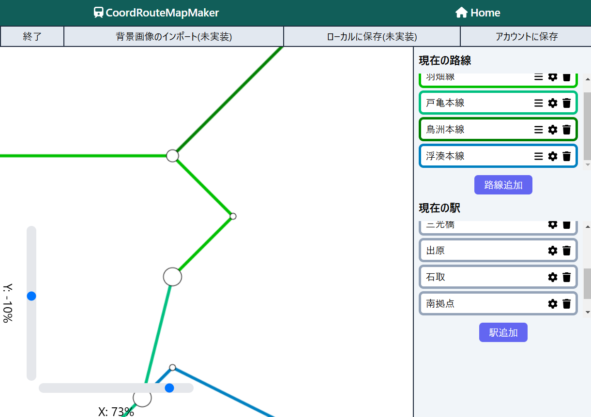

# Coord-RouteMapMaker

- 座標を入力して路線図を作成できるWebアプリである。
- 路線図を作成できるWebアプリはネット上にいろいろあるが、現実世界の路線図を再現したり、
  空想の路線を作るなどの内容が多かった。そのため、マイクラなどのゲーム内で作った鉄道の路線図を作るには、不便なものが多かった。
  そこで、座標を入力して路線図を作ることで、現実世界以外での路線図作りがしやすくなると考えた。
- (https://coord-route-map-maker.vercel.app/)

## 特徴と機能の説明

- 現在実現している機能を元に解説する。(注)現在はPCの人向けの開発に注力しており、スマホだと画面が崩れる可能性有
  
- 画面上部はファイルに関するボタンがあり、現在は左の終了と右のローカル、アカウントに保存が使える。
  左の終了は現在作成していたデータも消えてしまうが、右の保存はきちんとデータが残る。
  なお、現在はアカウントの認証機能と削除機能が出来ていないため、アカウントに保存は全員が共用となる。
- 画面右部は路線や駅の設定をするところである。
  ゴミマークは削除であり、ギアマークは編集であり、三本線は路線に対する駅の追加である。
  駅をまず追加していき、その後路線に駅を設定するという手順で路線図を作成できる。
- 画面左部は路線の表示であり、左下のスライダーを移動させることで画面を移動させることができる。
  現在は駅の追加が負の方向だったり、0に近かったりすると表示できないことがある。
  ズーム機能は今のところない。

## 使用技術 (技術スタック)

- 使用した言語やフレームワーク
  - TypeScript, Next.js, Prisma
  - faIcon
- 開発に使用したツールやウェブサービス
  - VSCode, Supabase, Vercel
- システム構成図
  [ User ]
  │
  ▼
  [ Next.js (Vercel) ] --(API Routes)--> [ Prisma ]
  │ │
  ▼ ▼
  [ UI ] [ Supabase (PostgreSQL) ]

## 開発期間・体制

- 開発体制: 個人開発
- 開発期間: 2024.12 ~ 2025.2 (約25時間)

## 工夫した点・苦労した点

- useStateを何も考えずに使うとスライダーが滑らかに動かなくなったりしたのが大変だった。
  1つ上の親要素でuseStateの関数を作ってpropsで与えることで、滑らかに動かすことができた。
- 動的に要素を増やしていける部分は一定数を超えるとその部分だけスクロールできるようにし、
  画面を覆いつくすことが無いように工夫した。
- ボタンになるべくfaIconを使うことで、余白ができるだけ多くなるように工夫した。

## 既知の課題と今後の展望

- 当初構想していた背景画像の組み込み機能、路線図のズーム機能、駅名の表示機能を完成させる。
- ローカルから読み込むプログラムでエラーをより詳細に伝えられるようにする。
- 路線図をデータだけでなく写真としても保存できるようにする。
- 複数人がこのサイトで路線図を作ってアップロードして、共有できるようにする。
  このとき、全体公開モードやurlを知っている人のみ公開モードも作る。
